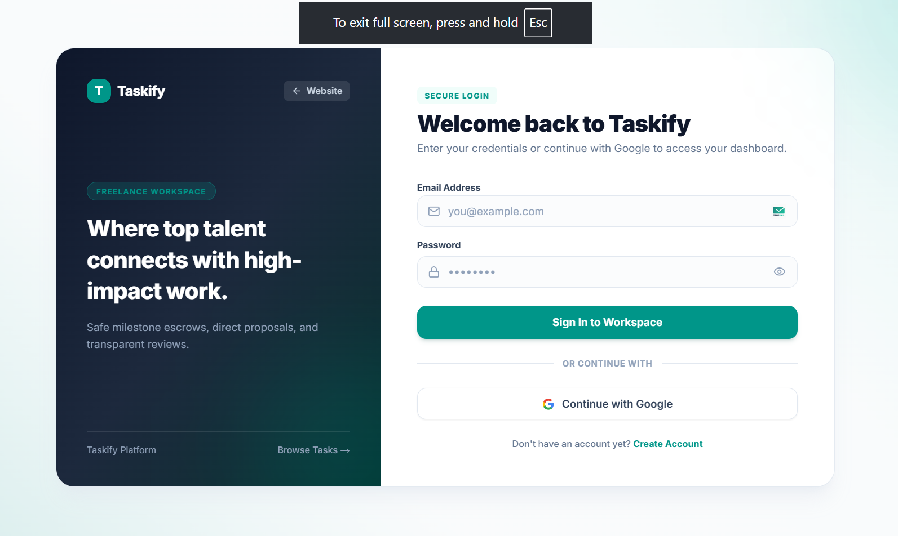
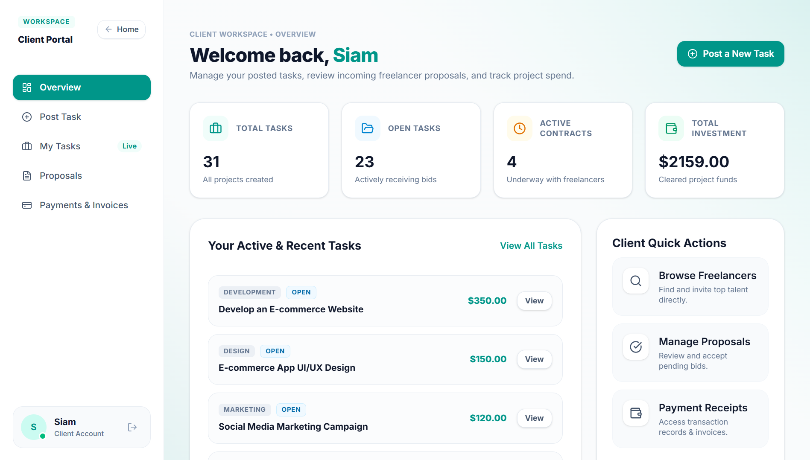
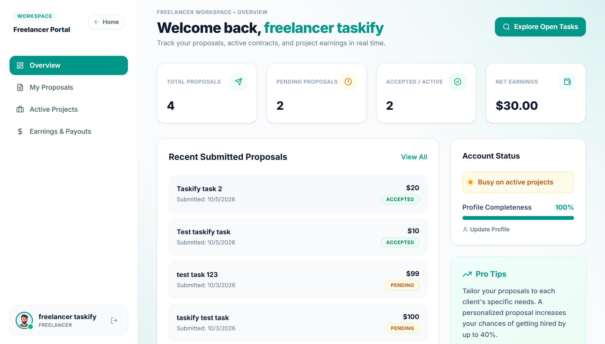
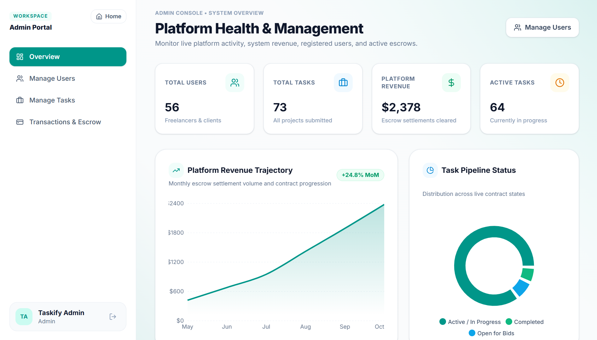
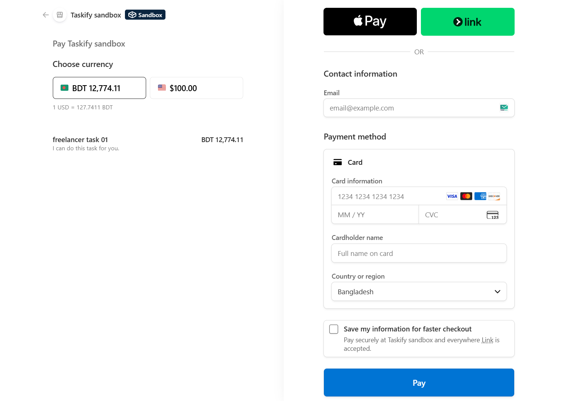

<div align="center">

# Taskify

**Scalable On-Demand Freelance Marketplace & Workflow Management Platform**

A modern, full-stack freelance platform engineering seamless collaboration between clients and independent talent. Built with Next.js 16 App Router, Tailwind CSS, MongoDB, and modern secure authentication.

---

<!-- Badges Strip -->
[](https://nextjs.org/)
[](https://react.dev/)
[](https://tailwindcss.com/)
[](https://www.mongodb.com/)
[](LICENSE)

[](https://taskify-live.vercel.app/)
[](https://github.com/Siam-AR/taskify/issues)
[](https://github.com/Siam-AR/taskify/issues)

</div>

---

## Table of Contents
1. [Overview & Core Value](#overview--core-value)
2. [Interface Previews](#interface-previews)
3. [Key Features](#key-features)
4. [Technology Stack](#technology-stack)
5. [System Architecture & Workflow](#system-architecture--workflow)
6. [Directory Structure](#directory-structure)
7. [API Route Specifications](#api-route-specifications)
8. [Getting Started & Local Installation](#getting-started--local-installation)
9. [Available Scripts](#available-scripts)
10. [Environment Variables](#environment-variables)
11. [Deployment](#deployment)
12. [Database Schema Models](#database-schema-models)
13. [Future Roadmap](#future-roadmap)
14. [Contributing Guidelines](#contributing-guidelines)
15. [License](#license)

---

## Overview & Core Value
**Taskify** bridges the gap between businesses sourcing verified specialists and independent professionals seeking high-impact contracts. Designed with performance and micro-interactions in mind, Taskify standardizes contract proposals, client reviews, dynamic talent cards, and secure role-based authentication flows.

### Primary Differentiators:
- **Strict Role-Based Segmentation**: Dynamic workspaces tailored for Clients (post tasks, manage bids, disburse payments) and Freelancers (discover contracts, submit proposals, track earnings).
- **Verified Review Engine**: Multi-factor 5-star ratings tied directly to completed contracts to prevent fraudulent reviews.
- **Modern Performance Core**: Server-side rendering (SSR), Turbopack tooling, and dynamic MongoDB projections for minimal payload latency.

---

## Interface Previews

| Landing Home Page | Authentication Shell |
| :---: | :---: |
|  |  |

| Client Dashboard | Freelancer Dashboard |
| :---: | :---: |
|  |  |

| Admin Dashboard | Stripe Checkout |
| :---: | :---: |
|  |  |

---

## Key Features

### Talent Marketplace & Discovery
- **Top Freelancers Engine**: Dynamically showcases verified talent with live availability status badges (`Available`, `Busy`, `Unavailable`), hourly billing rates, completed contract tallies, and single-row skill indicators.
- **Latest Opportunities Directory**: Filterable task cards displaying client budget commitments, real-time proposal counters, categories, and quick submission CTAs.
- **Freelancer Portfolio & History**: Comprehensive profiles showing verified review aggregates, work history, skills, and direct contact options.

### Contract Lifecycle & Proposals
- **Direct Proposal Bidding**: Freelancers submit milestone bids with delivery timelines and estimated cost breakdowns.
- **Escrow-Ready Milestone Workflow**: Integrated states (`open`, `in-progress`, `completed`, `cancelled`) for transparent delivery handoffs.
- **Post-Completion Ratings**: Automatic 5-star rating calculation and feedback collection upon milestone release.

### Resilient Authentication
- **Multi-Provider Auth**: Credentials-based email/password authentication alongside one-click Google OAuth.
- **State-Preserving Role Selection**: Pre-OAuth role selection (Client vs. Freelancer) persisted across redirects using secure cookie attributes.
- **Zero Premature Feedback**: Guarded toast notifications that display only after backend confirmation.

---

## Technology Stack

### Core Framework & Runtime
| Layer | Technology | Usage Description |
| :--- | :--- | :--- |
| **Framework** | Next.js 16 (App Router) | Server-rendered pages, API routes, Turbopack bundling |
| **Language** | JavaScript (ES6+ / Node.js) | Universal client and server execution |
| **UI Library** | React 19 | Declarative user interfaces and state management |
| **Styling** | Tailwind CSS 3 | Modern design system with `#009689` teal brand identity |
| **Iconography** | Lucide React | Clean, tree-shakeable SVG icons |
| **Notifications** | React-Toastify | Non-blocking user interaction notifications |

### Data & Infrastructure
| Layer | Technology | Usage Description |
| :--- | :--- | :--- |
| **Database** | MongoDB Atlas | Distributed NoSQL document storage |
| **Driver / ODM** | Native MongoDB / Mongoose | High-throughput aggregation pipelines and schema models |
| **Authentication** | Better-Auth | Secure session cookies, OAuth 2.0 integration, and RBAC |
| **Hosting** | Vercel | Edge deployment with automatic CI/CD |

---

## System Architecture & Workflow

```text
[ Client / Freelancer Browser ]
            │
            ▼
[ Next.js 16 App Router ] ─── (SSR & React Server Components)
            │
  ┌─────────┴───────────────────────────┐
  │                                     │
[ Client Components ]          [ Route Handlers ]
(Forms, UI, Toast Engine)      (/api/tasks, /api/freelancers)
  │                                     │
  ▼                                     ▼
[ Auth Guard / Cookies ]       [ MongoDB Connection Pool ]
(taskify_oauth_role)                    │
                                        ▼
                           [ MongoDB Atlas Cluster ]
                               ├── users
                               ├── tasks
                               ├── proposals
                               └── reviews
```

---

## Directory Structure
```text
taskify/
├── public/
│   ├── favicon.ico
│   ├── logo.svg
│   └── screenshots/          # Preview images referenced in documentation
├── src/
│   ├── app/
│   │   ├── layout.jsx        # Root HTML layout with fonts and toast provider
│   │   ├── page.jsx          # Landing page (Hero, Latest Tasks, Top Freelancers)
│   │   ├── auth/
│   │   │   ├── signin/page.jsx    # Credentials & OAuth sign-in view
│   │   │   └── signup/page.jsx    # Role-selection enabled sign-up view
│   │   ├── browse-tasks/          # Public contracts directory
│   │   ├── browse-freelancers/    # Public verified talent directory
│   │   ├── freelancers/[id]/      # Freelancer profile and verified review history
│   │   ├── tasks/[id]/            # Task details and proposal submission interface
│   │   ├── dashboard/             # Role-protected workspaces
│   │   │   ├── client/            # Task management and payment release
│   │   │   └── freelancer/        # Proposal management and submitted work
│   │   └── api/
│   │       ├── auth/[...all]/     # Authentication endpoints
│   │       ├── tasks/
│   │       │   ├── latest/        # Aggregated latest tasks with proposal counters
│   │       │   └── [id]/review/   # Milestone star review submission
│   │       ├── freelancers/
│   │       │   ├── top/           # Curated talent with dynamic availability states
│   │       │   └── [id]/reviews/  # Dual-lookup review retrieval (ID / Email)
│   │       └── proposals/         # Proposal submission and lifecycle handlers
│   ├── components/
│   │   ├── landing/          # Hero, TopFreelancers, LatestTasks sections
│   │   ├── shared/           # Navbar, Footer, Modals, Card primitives
│   │   └── ui/               # Buttons, Badges, Dropdowns, Inputs
│   ├── lib/
│   │   ├── auth.js           # Server-side auth setup and lifecycle hooks
│   │   ├── auth-client.js    # Browser auth client instance
│   │   └── server-db.js      # MongoDB connection helper (getAppDb)
│   ├── models/               # Schema definitions (User, Task, Proposal, Review)
│   └── styles/
│       └── globals.css       # Tailwind directives and utility classes
├── .env.example              # Environment configuration template
├── next.config.mjs           # Next.js build and optimization flags
├── tailwind.config.js        # Tailwind color schemes, animations, plugins
└── package.json              # Manifest and package dependencies
```

---

## API Route Specifications

### 1. Authentication Endpoints
- `POST /api/auth/sign-in/email` — Authenticate user via email and password credentials.
- `POST /api/auth/sign-up/email` — Register new account with role assignment (client or freelancer).
- `GET /api/auth/callback/google` — OAuth 2.0 callback with persisted role assignment.

### 2. Task Management
- `GET /api/tasks/latest` — Retrieve open tasks populated with real-time `proposalsCount`.
- `POST /api/tasks` — Create a new project task (Authenticated Clients only).
- `POST /api/tasks/:id/review` — Submit a 1–5 star rating and feedback upon milestone approval.

### 3. Talent & Reviews
- `GET /api/freelancers/top` — Fetch top-rated talent with availability status and single-row skill sets.
- `GET /api/freelancers/:id/reviews?email=:email` — Fetch verified client reviews matching by `ObjectId` or email.

---

## Getting Started & Local Installation

### Prerequisites
- **Node.js**: v18.18.0 or higher (Node 20+ recommended)
- **Package Manager**: npm or pnpm
- **Database**: Local MongoDB instance or active MongoDB Atlas cluster URI

### Step-by-Step Setup

1. **Clone the repository:**
   ```bash
   git clone https://github.com/Siam-AR/taskify.git
   cd taskify
   ```

2. **Install project dependencies:**
   ```bash
   npm install
   ```

3. **Configure local environment variables:**
   ```bash
   cp .env.example .env.local
   ```
   *Edit `.env.local` with your MongoDB URI, Auth Secret, and Google OAuth credentials.*

4. **Run the local development server:**
   ```bash
   npm run dev
   ```

5. **Access the application:**
   Open [http://localhost:3000](http://localhost:3000) in your browser.

---

## Available Scripts

In the project directory, you can run the following NPM scripts:

| Command | Description |
| :--- | :--- |
| `npm run dev` | Runs the app in development mode with Turbopack. |
| `npm run build` | Compiles and builds the Next.js application for production. |
| `npm run start` | Starts the production server (requires `build` to be run first). |
| `npm run lint` | Runs ESLint to statically analyze the codebase for issues. |

---

## Environment Variables

Create a `.env.local` file in your root directory and supply the following variables:

```env
# Application Host
PORT=3000
NEXT_PUBLIC_APP_URL=http://localhost:3000

# Authentication Configuration
BETTER_AUTH_SECRET=your_super_secret_base64_string_here
BETTER_AUTH_URL=http://localhost:3000

# Google OAuth Credentials
GOOGLE_CLIENT_ID=your-google-client-id.apps.googleusercontent.com
GOOGLE_CLIENT_SECRET=your-google-client-secret

# Database Configuration
MONGODB_URI=mongodb+srv://<username>:<password>@cluster0.mongodb.net/taskify?retryWrites=true&w=majority
MONGODB_DB=taskify
```

---

## Deployment

Taskify is optimized for deployment on [Vercel](https://vercel.com) for edge-network performance and CI/CD pipelines.

1. **Push to GitHub**: Ensure your code is pushed to your remote repository.
2. **Import to Vercel**: Create a new project in Vercel and import your repository.
3. **Environment Variables**: Copy all variables from your `.env.production` or `.env.local` into the Vercel Environment Variables dashboard.
   - *Ensure `NEXT_PUBLIC_APP_URL` and `BETTER_AUTH_URL` point to your production Vercel domain.*
4. **Deploy**: Vercel will automatically detect the Next.js framework, run `npm run build`, and deploy the application.

**Database Note**: Ensure your MongoDB Atlas cluster network access is configured to allow connections from Vercel (`0.0.0.0/0`), or peer it properly with your hosting environment.

---

## Database Schema Models

```text
User Document
├── _id: ObjectId
├── name: String
├── email: String (Unique)
├── role: "client" | "freelancer" | "admin"
├── designation: String
├── hourlyRate: Number
├── status: "available" | "busy" | "unavailable"
├── rating: Number (e.g., 4.9)
├── reviewsCount: Number
└── skills: Array<String>

Task Document
├── _id: ObjectId
├── title: String
├── description: String
├── category: String
├── budget: Number
├── budgetType: "Fixed" | "Hourly"
├── clientId: ObjectId (Ref: User)
├── status: "open" | "in-progress" | "completed" | "cancelled"
├── proposalsCount: Number
└── review: { rating: Number, comment: String, reviewedAt: Date }

Review Document
├── _id: ObjectId
├── freelancerId: ObjectId (Ref: User)
├── freelancer_email: String
├── clientId: ObjectId (Ref: User)
├── clientName: String
├── rating: Number (1 - 5)
├── comment: String
└── created_at: Date
```

---

## Future Roadmap

Taskify is an actively evolving platform. The following features are prioritized for upcoming releases:

- **Real-Time Messaging System**: Direct, WebSocket-powered communication channels between clients and freelancers.
- **Direct Task Invitations**: Empower clients to browse verified talent profiles and explicitly invite them to bid on open tasks.
- **Stripe Escrow Integration**: Secure fiat payment gateways to hold client funds in escrow until milestone deliverables are approved.

---

## Contributing Guidelines

Contributions keep open-source platforms resilient and reliable. Follow these steps:

1. Fork the Project Repository.
2. Create your Feature Branch:
   ```bash
   git checkout -b feature/AmazingFeature
   ```
3. Commit your Changes:
   ```bash
   git commit -m "feat: add AmazingFeature support"
   ```
4. Push to the Branch:
   ```bash
   git push origin feature/AmazingFeature
   ```
5. Open a Pull Request.

---

## License

Distributed under the MIT License. See `LICENSE` for further details.
